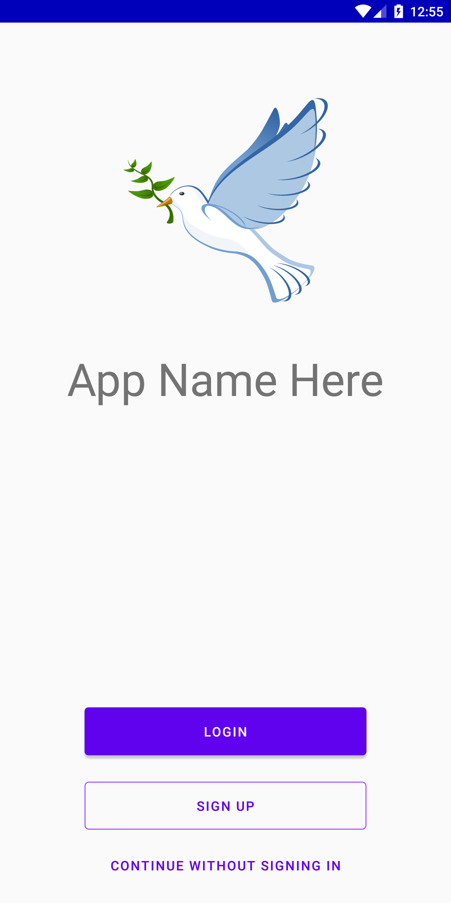
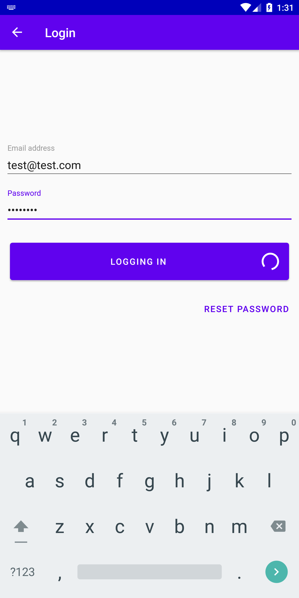
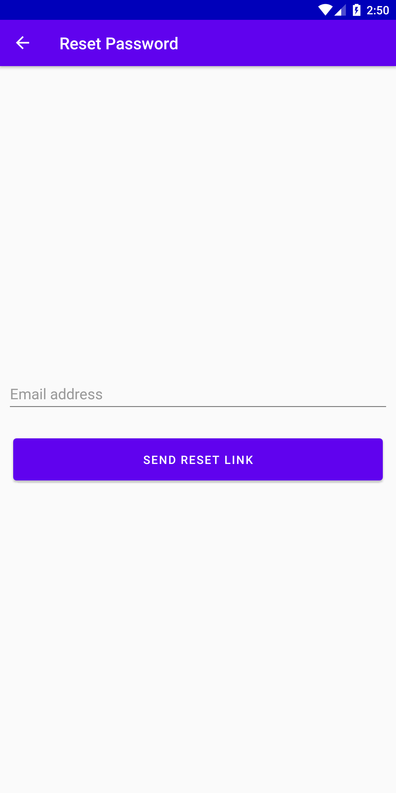
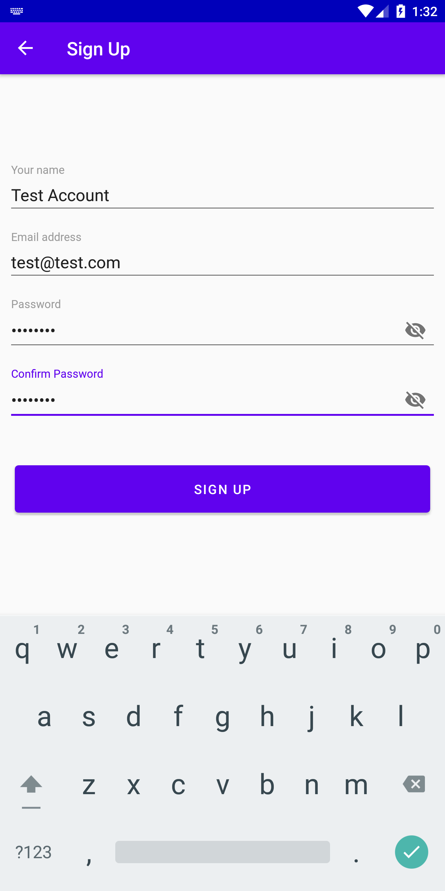
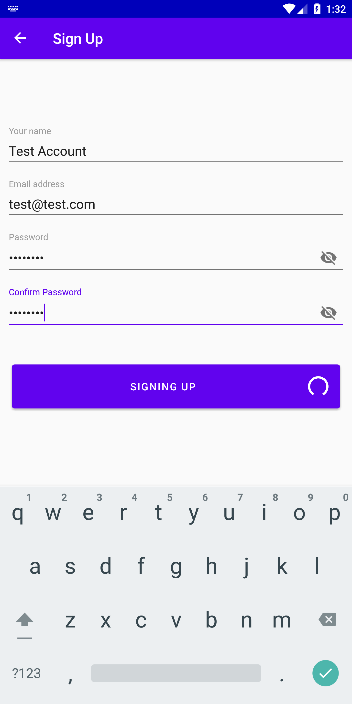
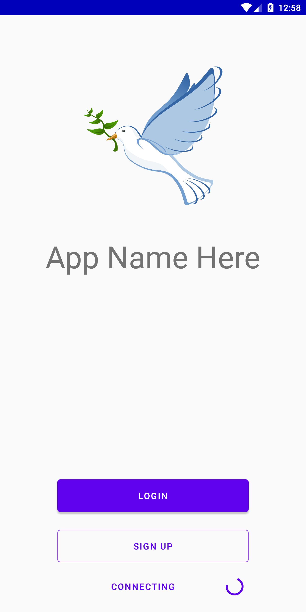

# Sample-Firebase-Login

A native android sample of implementing firebase login and signup. This sample project can be modified to suit your needs. I plan to maintain this project to help myself and others get a good place from where they can get a simple login and signup page for their android apps. Even if you do not use firebase, you can use the layouts in your project.

## Screenshots
||
----------------------------------------------------|----------------------------------------------------|--------------------------------------------------------------
||

## Motivation
I am planning to create a series of small sample android apps which can then be used when building a larger app. This reduces the time needed to deal with minor tasks such as setting up login and sign up and allows to focus on more important tasks instead. This project is the first installment in that series!

## Code Style
Try to follow the [AOSP Code style](https://source.android.com/setup/contribute/code-style) or the [Google Java style guide](https://google.github.io/styleguide/javaguide.html). I know I won't be able to follow them thoroughly though :wink:

## Built for Android
- Min SDK version : 19 (KitKat)
- Target SDK version : 28 (Android Pie)
- Compile SDK version : 28
- AndroidX repositories are used
- Data binding is enabled
- Compiled with Java compatibility 1.8

### External Dependencies:-
- [Google Material Components](https://github.com/material-components/material-components-android)
- [Firebase](https://firebase.google.com/) Core and Auth
- [Jetpack](https://developer.android.com/jetpack/) Navigation (Android Architecture)
- [FancyToast-Android](https://github.com/Shashank02051997/FancyToast-Android)  

## Work in Progress
 - [X] Creating a new Android Studio Project
 - [X] Adding relevant dependencies
 - [X] Creating Layouts
 - [X] Creating Fragments
 - [X] Creating Navigation Graph
 - [X] Implementing FirebaseAuth for Login
 - [X] Implementing FirebaseAuth for SignUp
 - [X] Implement reset password
 - [X] Implement Anonymous Sign in
 - [X] Add sign out options on welcome page
 - [X] Check for sign in at pre-login page
 - [X] Add option to change password
 - [X] Add option to delete user account
 - [ ] Remove back navigation from welcome page (Refer issue #1)
 - [ ] ~~Implementing FirebaseAuth for Single Click Email Login~~ - Not on priority
 - [ ] ~~Adding Email Verification~~ - Not on priority

## Usage
To use this sample in your own project, you can either clone this repo and build a completely new app or you can take the relevant layouts and fragments you need. Either way, please give credit where due and use in accordance with the license.

## Tests
No Tests yet. If you could help create some, please open an issue!

## Contributing
Feel free to open issues and PRs. However, please don't just complete this project for me. Let me complete the base repository and you can add more features later. Contributing guidelines will be up soon.

## License
Copyright 2019 Yashovardhan Dhanania

   Licensed under the Apache License, Version 2.0 (the "License");
   you may not use this file except in compliance with the License.
   You may obtain a copy of the License at

       http://www.apache.org/licenses/LICENSE-2.0

   Unless required by applicable law or agreed to in writing, software
   distributed under the License is distributed on an "AS IS" BASIS,
   WITHOUT WARRANTIES OR CONDITIONS OF ANY KIND, either express or implied.
   See the License for the specific language governing permissions and
   limitations under the License.
